# Architecture Overview

This document describes the high-level architecture of the Better Habits application, covering data storage, synchronization, authentication, and platform-specific implementations.

## Table of Contents

- [System Architecture](#system-architecture)
- [Platform Differences](#platform-differences)
- [Database Architecture](#database-architecture)
- [Sync Mechanism](#sync-mechanism)
- [Authentication Flow](#authentication-flow)
- [Data Flow](#data-flow)
- [Key Design Decisions](#key-design-decisions)
- [SQLite Usage & Performance](#sqlite-usage--performance)
- [Technology Stack](#technology-stack)

---

## System Architecture

Better Habits is a cross-platform React Native application with an **offline-first, eventually-consistent** architecture. The app runs on iOS, Android, and Web, with different storage strategies per platform.


---

## Platform Differences

### iOS / Android (Native Platforms)

**Architecture**: Offline-first with background sync

| Layer           | Technology             | Purpose                               |
| --------------- | ---------------------- | ------------------------------------- |
| **UI**          | React Native + Tamagui | Cross-platform UI components          |
| **State**       | Zustand                | Lightweight state management          |
| **Local DB**    | SQLite (expo-sqlite)   | Offline storage, instant reads/writes |
| **Persistence** | MMKV                   | Auth sessions, sync cursors, settings |
| **Sync**        | Background tasks       | Push/pull changes to Supabase         |
| **ORM**         | Drizzle ORM            | Type-safe database queries            |

**Data Flow**:

1. User interacts with UI
2. Changes saved immediately to SQLite
3. Changes queued in outbox for sync
4. Background sync sends to Supabase (when online)
5. Pull sync fetches updates from other devices

**Offline Support**: ✅ Full - app works completely offline

### Web Platform

**Architecture**: Direct server connection

| Layer           | Technology                 | Purpose                                                  |
| --------------- | -------------------------- | -------------------------------------------------------- |
| **UI**          | React Native Web + Tamagui | Web-compatible UI components                             |
| **State**       | Zustand                    | Lightweight state management                             |
| **Local DB**    | None                       | No local database                                        |
| **Persistence** | localStorage               | Auth sessions, theme preferences                         |
| **Data**        | Direct Supabase queries    | Real-time server connection                              |
| **Caching**     | None (yet)                 | See [web-caching-strategy.md](./web-caching-strategy.md) |

**Data Flow**:

1. User interacts with UI
2. Direct query to Supabase (HTTPS)
3. UI updates on response

**Offline Support**: ❌ None - requires internet connection

**Future**: React Query + IndexedDB for caching (see [Web Caching Strategy](./web-caching-strategy.md))

---

## Database Architecture

### Dual Schema System

The app uses **two separate but synchronized database schemas**:


**Why two schemas?**

- Different SQL dialects (SQLite vs PostgreSQL)
- Different features (SQLite is simpler, Postgres has RLS)
- Different performance characteristics
- See [Schema Architecture](./schema-architecture.md) for details

### Schema Definitions

**Location**:

- SQLite: `src/db/sqlite/schema.ts`
- Postgres: `src/db/postgres/schema.ts`

**Tables** (driven by DOMAIN config):

1. **Primary Entity** (habits) - Main domain objects
2. **Entries** (habit_entries) - Activity records for primary entities
3. **Reminders** - Notification schedules
4. **Devices** - Push notification tokens
5. **Outbox** (SQLite only) - Sync queue for pending changes

### Row Level Security (RLS)

Postgres schema includes RLS policies for multi-tenant security:

```sql
-- Auto-generated from DOMAIN config
create policy "Users can manage their own habits"
  on public.habits
  using (auth.uid() = user_id)
  with check (auth.uid() = user_id);
```

All RLS policies are:

- Auto-generated from DOMAIN config
- Applied during migrations
- User-scoped (users can only access their own data)

See [Database Migrations](./database-migrations.md) for migration workflows.

---

## Sync Mechanism

### Overview

The sync system is a **bidirectional, eventually-consistent** architecture based on:

- **Outbox pattern** for reliable local changes
- **Cursor-based pagination** for efficient pulls
- **Version vectors** for conflict resolution
- **Idempotent operations** for safe retries

### Sync Flow


### Implementation

**Code locations**:

- Push: [src/sync/driver.ts:pushOutbox()](../src/sync/driver.ts)
- Pull: [src/sync/driver.ts:pullUpdates()](../src/sync/driver.ts)
- Outbox: [src/sync/outbox.ts](../src/sync/outbox.ts)
- Cursors: [src/sync/cursors.ts](../src/sync/cursors.ts)
- Background: [src/sync/useSyncTask.ts](../src/sync/useSyncTask.ts)

**Sync trigger**:

```typescript
// Configured in src/ui/providers/AppProviders.tsx
useSync({
  push: pushOutbox,
  pull: pullUpdates,
  enabled: syncEnabled,
  autoStart: syncEnabled,
  backgroundInterval: 15 * 60, // 15 minutes
});
```

### Conflict Resolution

**Strategy**: Last-write-wins (LWW) based on `updated_at` timestamp

```typescript
// Postgres merge logic (simplified)
INSERT INTO habits (id, name, updated_at, ...)
VALUES ($1, $2, $3, ...)
ON CONFLICT (id) DO UPDATE SET
  name = CASE WHEN EXCLUDED.updated_at > habits.updated_at
              THEN EXCLUDED.name
              ELSE habits.name
         END,
  updated_at = GREATEST(EXCLUDED.updated_at, habits.updated_at);
```

**Guarantees**:

- ✅ Eventual consistency across devices
- ✅ No data loss (all changes preserved)
- ⚠️ Last write wins (conflicts resolved by timestamp)

---

## Authentication Flow

### Sign Up / Sign In


### Session Management

**Implementation**: [src/auth/session.ts](../src/auth/session.ts)

**Session lifecycle**:

1. User logs in → JWT token stored
2. Supabase client auto-refreshes token
3. Token included in all API requests
4. Session listener updates app state
5. On logout → Clear session + local data

**Storage**:

- **iOS/Android**: Supabase uses MMKV via custom storage adapter
- **Web**: Supabase uses localStorage (default)

---

## Data Flow

### Write Operation (Create/Update/Delete)

**iOS/Android Flow (Offline-First)**:

```mermaid
sequenceDiagram
    participant User
    participant Repo as Repository<br/>(createHabit)
    participant SQLite
    participant Outbox
    participant UI
    participant BgSync as Background Sync<br/>(15 min)
    participant Supabase
    participant OtherDevices as Other Devices

    User->>Repo: Create/Update/Delete
    Repo->>SQLite: Write immediately
    Repo->>Outbox: Add to queue
    Repo->>UI: Optimistic update
    Note over UI: Instant feedback

    BgSync->>Outbox: Check queue
    BgSync->>Supabase: pushOutbox() → sync-push
    Supabase->>Supabase: Apply to Postgres
    Supabase-->>BgSync: Success
    OtherDevices->>Supabase: pullUpdates() → sync-pull
    Supabase-->>OtherDevices: Send changes
```



**Web Flow (Direct Connection)**:


### Read Operation

**iOS/Android Flow (Offline-Capable)**:


**Web Flow (Direct Query)**:


---

## Key Design Decisions

### 1. **Offline-First for Native, Direct Connection for Web**

**Decision**: Use SQLite + sync on native, direct Supabase queries on web

**Rationale**:

- Native platforms benefit from offline capability (common use case)
- SQLite on web has limitations (no SharedArrayBuffer support)
- Web is typically used in online contexts
- Direct queries are simpler for web

**Trade-offs**:

- ✅ Better UX on native (instant, offline)
- ✅ Simpler web implementation
- ❌ Web has no offline support (yet)
- ❌ Different codepaths per platform

**Future**: Add React Query + IndexedDB for web caching

### 2. **Dual Schema (SQLite + Postgres)**

**Decision**: Maintain separate but synchronized schemas

**Rationale**:

- Different SQL dialects and features
- SQLite optimized for mobile (simple, fast)
- Postgres optimized for cloud (RLS, advanced features)
- DOMAIN config keeps them in sync

**Trade-offs**:

- ✅ Optimized for each platform
- ✅ Type-safe with Drizzle ORM
- ❌ More maintenance (two schemas)
- ❌ Must keep in sync manually

**Mitigation**: Automated checks in `npm start` via [scripts/troubleshoot.mjs](../scripts/troubleshoot.mjs)

### 3. **Outbox Pattern for Reliable Sync**

**Decision**: Queue local changes before syncing

**Rationale**:

- Guarantees no data loss (even if sync fails)
- Allows retry logic
- Decouples writes from sync
- Enables batch operations

**Trade-offs**:

- ✅ Reliable (guaranteed delivery)
- ✅ Fast local writes
- ✅ Works offline
- ❌ More complex (outbox table, cleanup)
- ❌ Eventual consistency (not immediate)

### 4. **Background Sync Every 15 Minutes**

**Decision**: Periodic background sync vs real-time

**Rationale**:

- Battery efficiency (not continuous)
- Good enough for habit tracking use case
- Simpler than WebSocket management
- Works on iOS background restrictions

**Trade-offs**:

- ✅ Battery efficient
- ✅ Simple implementation
- ✅ Reliable across platforms
- ❌ Not real-time (15 min lag)
- ❌ Potential conflicts if editing same data

**Note**: User can manually trigger sync via pull-to-refresh

### 5. **Last-Write-Wins Conflict Resolution**

**Decision**: Use timestamp-based LWW for conflicts

**Rationale**:

- Simple to implement
- Deterministic (same result on all devices)
- Good enough for habit tracking (low conflict rate)
- Avoids complex CRDT implementations

**Trade-offs**:

- ✅ Simple and predictable
- ✅ Works for single-user scenarios
- ❌ Can lose data in true conflicts
- ❌ Not suitable for collaborative editing

**Future**: Consider operational transforms for collaborative features

### 6. **DOMAIN-Driven Generic Architecture**

**Decision**: Make entire codebase configurable via `DOMAIN` config

**Rationale**:

- Reusable as a starter template
- Easy to adapt for other apps (tasks, workouts, etc.)
- Single source of truth for naming
- Type-safe throughout

**Trade-offs**:

- ✅ Highly reusable template
- ✅ Consistent naming everywhere
- ✅ Easy to rebrand
- ❌ Slightly more complex than hardcoding
- ❌ Generic naming less readable

**Value**: This architecture makes the entire app a reusable template

---

## SQLite Usage & Performance

### How SQLite is Used

**Initialization**:

1. App launches on iOS/Android
2. SQLite database file is created: `betterhabits.db` (from `DOMAIN.app.database`)
3. Database location:
   - **iOS**: `~/Library/Developer/CoreSimulator/Devices/[DEVICE_ID]/data/Containers/Data/Application/[APP_ID]/Documents/ExponentExperienceData/@luvenapps/betterhabits/SQLite/betterhabits.db`
   - **Android**: `/data/data/[package.name]/databases/betterhabits.db`
4. Schema is created on first access (via Drizzle ORM)
5. No automatic migrations on startup (see [Database Migrations](./database-migrations.md))

**Operations**:

- **Read**: Instant queries from local SQLite (no network)
- **Write**: Immediate write to SQLite + queue in outbox for sync
- **Sync**: Background task uploads outbox to Supabase every 15 minutes

### Performance Considerations

#### Storage Limits

**SQLite Theoretical Limits**:

- Max database size: 281 TB (theoretical)
- Max table size: 281 TB
- Max row size: 1 GB
- Max rows per table: 2^64

**Practical Mobile Limits**:

- **iOS**: Device storage (typically 64GB - 1TB)
- **Android**: Device storage (typically 32GB - 512GB)
- **Recommended DB size**: < 100MB for optimal performance

#### Performance Characteristics

**Current Implementation**:

| Operation             | Performance            | Notes                          |
| --------------------- | ---------------------- | ------------------------------ |
| **Read (indexed)**    | < 1ms                  | Indexed queries (userId, date) |
| **Read (full table)** | Linear O(n)            | Avoid unless necessary         |
| **Write**             | < 1ms                  | Single record insert/update    |
| **Bulk insert**       | ~100 records/ms        | Using transactions             |
| **Sync (push)**       | Depends on outbox size | Max 100 items per batch        |
| **Sync (pull)**       | Depends on changes     | Cursor-based, efficient        |

**Indexes** (defined in [schema.ts](../src/db/sqlite/schema.ts)):

```typescript
// Primary Entity (habits)
index('habits_user_updated_idx').on(table.userId, table.updatedAt);

// Entries
uniqueIndex('habit_entries_unique').on(table.habitId, table.date, table.deletedAt);
index('habit_entries_user_habit_idx').on(table.userId, table.habitId, table.date);

// Reminders
index('reminders_user_habit_enabled_idx').on(table.userId, table.habitId, table.isEnabled);
```

These indexes ensure:

- ✅ Fast user-scoped queries
- ✅ Efficient date-based lookups
- ✅ Quick habit-to-entries joins

### Data Growth Scenarios

#### Scenario 1: Typical User (1 year)

```
Assumptions:
- 5 habits tracked
- 1 entry per day per habit
- 365 days

Calculation:
- Habits: 5 × 500 bytes = 2.5 KB
- Entries: 5 × 365 × 200 bytes = 365 KB
- Total: ~368 KB

Performance: ✅ Excellent (< 1ms queries)
```

#### Scenario 2: Power User (5 years)

```
Assumptions:
- 20 habits tracked
- 2 entries per day (morning + evening check-ins)
- 1825 days (5 years)

Calculation:
- Habits: 20 × 500 bytes = 10 KB
- Entries: 20 × 2 × 1825 × 200 bytes = 14.6 MB
- Reminders: 20 × 300 bytes = 6 KB
- Total: ~15 MB

Performance: ✅ Good (< 5ms queries with indexes)
```

#### Scenario 3: Extreme User (10 years, no cleanup)

```
Assumptions:
- 50 habits over lifetime (many deleted)
- 3 entries per day
- 3650 days (10 years)

Calculation:
- Habits: 50 × 500 bytes = 25 KB
- Entries: 50 × 3 × 3650 × 200 bytes = 109.5 MB
- Total: ~110 MB

Performance: ⚠️ Acceptable but slower (10-50ms queries)
Action: Consider data archiving
```

### Data Cleanup Strategies

**Current Strategy**: Soft Deletes

All records have a `deletedAt` column:

- Deleted items are marked with timestamp, not removed
- Preserved for sync (other devices need to know about deletes)
- Can be filtered out in queries

**Recommended Future Improvements**:

#### 1. **Automatic Cleanup of Soft-Deleted Records**

```typescript
// Cleanup records deleted > 90 days ago
async function cleanupOldDeletes() {
  const cutoffDate = new Date();
  cutoffDate.setDate(cutoffDate.getDate() - 90);

  await db
    .delete(primaryEntity)
    .where(
      and(
        isNotNull(primaryEntity.deletedAt),
        lt(primaryEntity.deletedAt, cutoffDate.toISOString()),
      ),
    );
}
```

**Schedule**: Run monthly or on app launch

#### 2. **Archive Old Entries**

```typescript
// Archive entries older than 2 years
async function archiveOldEntries() {
  const cutoffDate = new Date();
  cutoffDate.setFullYear(cutoffDate.getFullYear() - 2);

  // Option A: Delete from SQLite (keep in Supabase as backup)
  await db.delete(entryEntity).where(lt(entryEntity.createdAt, cutoffDate.toISOString()));

  // Option B: Export to JSON and store in device documents
  // Then delete from SQLite
}
```

**Schedule**: Annual cleanup

#### 3. **VACUUM Database**

```typescript
// Reclaim space after deletes
async function vacuumDatabase() {
  const { openDatabaseSync } = await import('expo-sqlite');
  const db = openDatabaseSync(DOMAIN.app.database);

  // Run VACUUM command
  db.execSync('VACUUM');
}
```

**When**: After bulk deletes or annual cleanup

#### 4. **Limit Sync Window**

```typescript
// Only sync recent data (e.g., last 2 years)
// Older data stays in Supabase but not synced to device
const SYNC_WINDOW_DAYS = 730; // 2 years

async function pullUpdates() {
  const cutoffDate = new Date();
  cutoffDate.setDate(cutoffDate.getDate() - SYNC_WINDOW_DAYS);

  // Only pull records updated after cutoff
  // Supabase keeps all history
}
```

**Benefit**: Keeps SQLite small while preserving cloud backup

### Performance Monitoring

**Recommended metrics to track**:

```typescript
// Track database size
async function getDatabaseSize() {
  const { openDatabaseSync } = await import('expo-sqlite');
  const db = openDatabaseSync(DOMAIN.app.database);

  const result = db.getFirstSync<{ size: number }>(
    'SELECT page_count * page_size as size FROM pragma_page_count(), pragma_page_size()',
  );

  return result?.size || 0; // Size in bytes
}

// Track query performance
async function benchmarkQuery(queryFn: () => Promise<any>) {
  const start = performance.now();
  await queryFn();
  const duration = performance.now() - start;

  // Log if > 100ms
  if (duration > 100) {
    console.warn(`Slow query detected: ${duration}ms`);
  }

  return duration;
}
```

### When to Worry

**Green Zone** (< 10 MB):

- ✅ All queries fast
- ✅ No action needed

**Yellow Zone** (10 MB - 50 MB):

- ⚠️ Some queries may slow down
- 💡 Consider adding more indexes
- 💡 Review query patterns

**Red Zone** (> 50 MB):

- ❌ Noticeable performance impact
- 🔴 Implement cleanup strategies
- 🔴 Consider data archiving
- 🔴 Add pagination to large queries

### Best Practices

1. **Always use indexes** for frequently queried columns
2. **Implement pagination** for large result sets
3. **Use transactions** for bulk operations
4. **Soft delete** initially, hard delete after sync confirmation
5. **Monitor database size** and implement cleanup when > 50MB
6. **VACUUM regularly** to reclaim space
7. **Limit sync window** for very old data
8. **Test with realistic data volumes** (not just 10 test records)

### SQLite-Specific Optimizations

**Pragma Settings** (can be added to initialization):

```typescript
// Enable WAL mode for better concurrency
db.execSync('PRAGMA journal_mode = WAL');

// Optimize for mobile
db.execSync('PRAGMA synchronous = NORMAL');
db.execSync('PRAGMA temp_store = MEMORY');
db.execSync('PRAGMA mmap_size = 30000000000');
```

**Query Optimization**:

```typescript
// Bad: Full table scan
const habits = await db.select().from(primaryEntity);

// Good: Indexed query
const habits = await db
  .select()
  .from(primaryEntity)
  .where(eq(primaryEntity.userId, userId))
  .orderBy(desc(primaryEntity.updatedAt))
  .limit(100);
```

---

## Technology Stack

### Frontend

- **Framework**: React Native (Expo)
- **UI Library**: Tamagui (universal design system)
- **Navigation**: Expo Router (file-based)
- **State**: Zustand (lightweight, simple)
- **Type Safety**: TypeScript (strict mode)

### Backend

- **Platform**: Supabase (hosted Postgres + Auth + Edge Functions)
- **Database**: PostgreSQL 15+
- **Auth**: Supabase Auth (JWT-based)
- **Functions**: Deno Edge Functions (sync-push, sync-pull, export)
- **Storage**: Supabase Storage (future)

### Database & ORM

- **Local**: SQLite (expo-sqlite)
- **Cloud**: PostgreSQL (Supabase)
- **ORM**: Drizzle ORM (type-safe, lightweight)
- **Migrations**: Drizzle Kit

### Storage & Persistence

- **iOS/Android**: MMKV (native key-value)
- **Web**: localStorage / sessionStorage
- **Future Web**: IndexedDB (planned)

### Development & Tooling

- **Package Manager**: npm
- **Linting**: ESLint
- **Formatting**: Prettier
- **Testing**: Jest + React Native Testing Library
- **E2E**: Maestro
- **CI/CD**: GitHub Actions

---

## Related Documentation

- [Database Migrations](./database-migrations.md) - Schema changes and migration workflows
- [Schema Architecture](./schema-architecture.md) - Why two schemas and how they stay in sync
- [Web Caching Strategy](./web-caching-strategy.md) - Future web performance improvements
- [Roadmap](./roadmap.md) - Current status and upcoming milestones

---

## Diagrams Legend

```
┌─────┐
│ Box │  = Component, Service, or Layer
└─────┘

  ↓ →   = Data flow direction

  ✅    = Supported feature
  ❌    = Not supported / limitation
  ⚠️    = Trade-off or caveat
```

---

_Last Updated: 2025-11-03_
